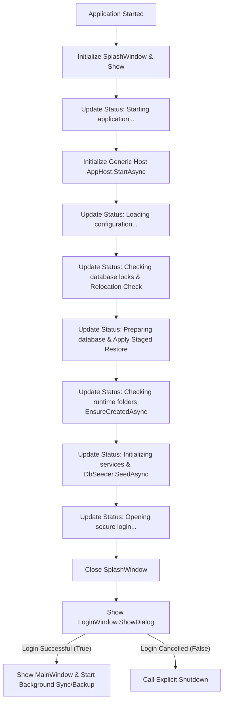

# Phase 12B: Splash Screen Startup Notes

This document describes the implementation, visual styling, and lifecycle integration of the professional Splash Screen for **Ilm-o-Kutub System**.

---

## 1. Visual Design & Presentation

The Splash Screen is designed as a borderless centered window, sized **720x420**, reflecting the administrative and professional styling constraints of the application:
- **Background**: Solid dark charcoal (`#1F2937`), creating a clean, modern aesthetic.
- **Accents**: Top bar features signature color rectangles in corporate blue (`#2563EB`) and teal (`#0F766E`).
- **Typography**: 
  - Main App Title: "Ilm o Kutub System" (42pt Bold Segoe UI, White, with a soft drop shadow).
  - Subtitle: "Advanced University Library Management System" (16pt SemiBold Segoe UI, Teal).
- **Progress Bar**: An indeterminate progress indicator styled with a horizontal linear gradient from blue to teal, keeping the interface feeling alive during startup.
- **Status Label**: Displays real-time updates as key background initialization steps occur.
- **Version Identifier**: Extracted dynamically from assembly metadata (e.g. `v1.0.0.0`) and displayed in the upper-right corner.
- **Footer**: Identifies the development context:
  - Left: "Developed for Advanced Visual Programming Lab"
  - Right: "Muhammad Hanzala, Muhammad Umar, Muhammad Umair"

---

## 2. Startup Flow & Lifecycle Integration

To ensure the splash screen closes cleanly and does not trigger issues with WPF `ShutdownMode.OnExplicitShutdown`, the startup lifecycle is structured as follows in `App.xaml.cs`:

### Key Integration Safeguards
1. **Thread-Safe Status Updates**: The `SplashWindow` implements thread-safe status message updates through a dispatcher-aware helper (`UpdateStatus`), ensuring background services can safely feed messages to the UI.
2. **Explicit Closing**: The splash screen is closed *before* the synchronous `LoginWindow.ShowDialog()` is invoked. This avoids leaving the splash screen lingering and ensures the Login screen gains focus.
3. **Robust Error Handling**: Any exception thrown during the startup sequence (such as SQLite connection failures or file access violations) is caught. The handler immediately closes the splash screen, shows a user-friendly error message dialog, and calls `Shutdown(-1)` to terminate the process cleanly without hanging.
4. **ShutdownMode Compliance**: The flow respects the custom `OnExplicitShutdown` mode, only showing the main shell after validated logins and properly exiting on cancellation.
