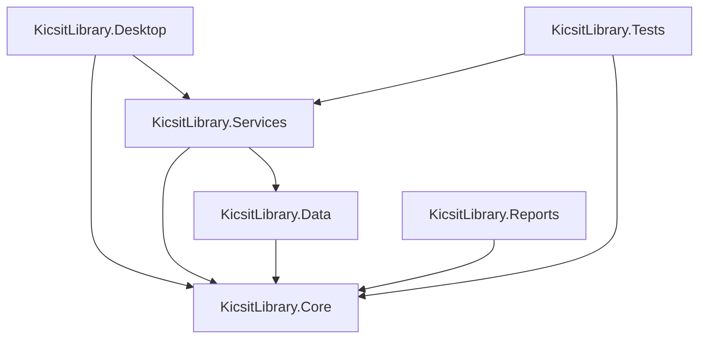

# Project Handoff: University Library Management System (ULMS)

This document provides a comprehensive overview of the architecture, structure, implementation status, and next steps for the WPF .NET 8 University Library Management System.

---

## 1. Solution Architecture & Project Structure

The project follows a clean architectural layout separating Core domain entities, Data access layers, Business services, and the WPF desktop view components.

### Projects in the Solution:
1. **`KicsitLibrary.Core`**: Contain domain entities (`BookMaster`, `BookCopy`, `Student`, `FacultyStaff`, `Fine`, `IssueRecord`, `Reservation`, `SystemSettings`, etc.), common enums (stored under `/Enums/`), and service interfaces (defined in `/Interfaces/`).
2. **`KicsitLibrary.Data`**: The repository and data persistence layer. Built on EF Core with SQLite support. Contains `KicsitLibraryDbContext.cs` and generic `Repository<T>` implementations. Includes `DbSeeder.cs` for database schema initial setup and data seeding.
3. **`KicsitLibrary.Services`**: Business logic implementations including:
   - `AuthenticationService` (Authentication, password hashing, and audit log generation)
   - `DashboardService` (Aggregated statistics for library analytics)
   - `CatalogService` (Advanced book metadata, physical copies management, shelf locations, and auto-accession sequencing)
   - `ConsumerService` (Student and Faculty directories, CNIC validations, and digital library card vector outputs)
   - `CirculationService` (Check-outs, returns condition check, late calculations, and fine waived/paid collection operations)
4. **`KicsitLibrary.Reports`**: Foundation project for report files and exports (FastReport, RDLC, or custom generators).
5. **`KicsitLibrary.Tests`**: Unit test suite utilizing xUnit/NUnit. Currently only contains placeholder classes.
6. **`KicsitLibrary.Desktop`**: The WPF Shell project. Operates on the MVVM pattern utilizing the `CommunityToolkit.Mvvm` framework. Includes custom XAML style sheets, vector barcodes, and QR image helper classes.

---

## 2. Implemented Modules
- **Authentication**: Fully functional login panel with robust hashed passwords. Uses a secure fallback seeder for default accounts (`admin` / `admin123`).
- **Library Catalog**: Comprehensive book catalog, details forms, physical copy management, shelf mapping, and sequence-based auto-accession.
- **Consumer Management**: Complete registration screens for Students, Faculty/Staff, and Visiting inspectors. Supports vector Code-39 barcodes and QR codes for Digital Library Cards.
- **Circulation Management**: Material check-out validations, returned book physical condition processing, automated fine calculations, payment collections, and waivers.

---

## 3. Pending Modules & Priorities
- **Priority 4: Overdue Engine & Notifications**: Automatic late item detection, overdue notifications, and background alert engine.
- **Priority 5: Reports & Export**: Generation of checkout logs, catalog stats, and student fines, exporting to PDF, Excel, and CSV.
- **Priority 6: Clearance System**: Integrated final clearance workflow for students and faculty graduating or leaving the university.
- **Priority 7: Audit, Compliance & Operations**: Internal audits, document archiving, new arrival announcements, and inventory counts.
- **Priority 8: System Utilities**: Data backup, database restore, Supabase sync integration, and installer configuration.

---

## 4. Known Risks & Considerations
- **No EF Migrations**: Database initialization uses `EnsureCreatedAsync()`. EF migrations must be added before staging.
- **SQLite Single User**: Uses SQLite, which lacks multi-user concurrent write capability. A migration to SQL Server will be required for multi-client deployment.
- **Missing Tests**: The test suite is currently a stub and needs test coverage.
