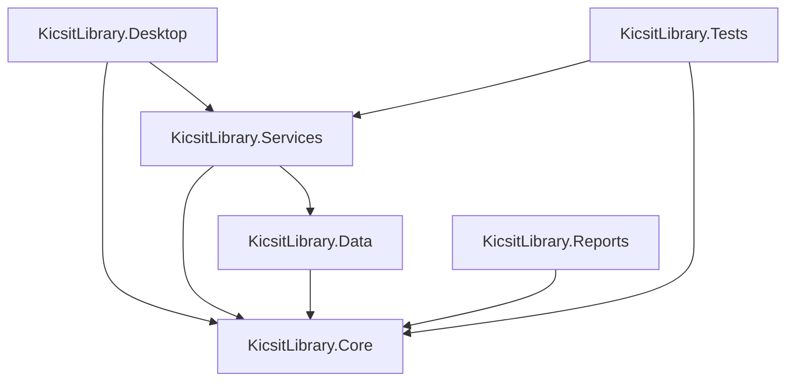

# Project Handoff: Ilm-o-Kutub System

This document provides a comprehensive overview of the architecture, structure, implementation status, and next steps for the .NET 8 WPF Ilm-o-Kutub System.

The visible product rename is complete. Internal `KicsitLibrary.*` project/namespace names and `KicsitLibrary.db` remain unchanged for compatibility.

---

## 1. Solution Architecture & Project Structure

The project follows a clean architectural layout separating Core domain entities, Data access layers, Business services, and the WPF desktop view components.

### Projects in the Solution:
1. **`KicsitLibrary.Core`**: Contain domain entities (`BookMaster`, `BookCopy`, `Student`, `FacultyStaff`, `Fine`, `IssueRecord`, `Reservation`, `SystemSettings`, etc.), common enums (stored under `/Enums/`), and service interfaces (defined in `/Interfaces/`).
2. **`KicsitLibrary.Data`**: The repository and data persistence layer. Built on EF Core with SQLite support. Contains `KicsitLibraryDbContext.cs` and generic `Repository<T>` implementations. Includes `DbSeeder.cs` for database schema initial setup and data seeding.
3. **`KicsitLibrary.Services`**: Business logic implementations including:
   - `AuthenticationService` (Authentication, password hashing, and audit log generation)
   - `DashboardService` (Aggregated statistics for library analytics)
   - `CatalogService` (Advanced book metadata, physical copies management, shelf locations, and auto-accession sequencing)
   - `ConsumerService` (Student and Faculty directories, CNIC validations, and digital library card vector outputs)
   - `CirculationService` (Check-outs, returns condition check, late calculations, and fine waived/paid collection operations)
4. **`KicsitLibrary.Reports`**: Data-first report contracts, sixteen providers, and CSV, Excel, and PDF exporters.
5. **`KicsitLibrary.Tests`**: Real xUnit test suite using isolated temporary SQLite databases. The current suite has 171 passing tests.
6. **`KicsitLibrary.Desktop`**: The WPF Shell project. Operates on the MVVM pattern utilizing the `CommunityToolkit.Mvvm` framework. Includes custom XAML style sheets, vector barcodes, and QR image helper classes.

---

## 2. Implemented Modules
- **Authentication**: Fully functional login panel with robust hashed passwords. Uses a secure fallback seeder for default accounts (`admin` / `admin123`).
- **Library Catalog**: Comprehensive book catalog, details forms, physical copy management, shelf mapping, and sequence-based auto-accession.
- **Consumer Management**: Complete registration screens for Students, Faculty/Staff, and Visiting inspectors. Supports vector Code-39 barcodes and QR codes for Digital Library Cards.
- **Circulation Management**: Material check-out validations, returned book physical condition processing, automated fine calculations, payment collections, and waivers.
- **Overdue, Notifications, and Scheduler**: Deterministic overdue processing, notification records, manual SMTP delivery, and a disabled-by-default hosted scheduler.
- **Reports and Clearance**: Sixteen reports, physical exports, student/faculty clearance checks, and branded PDF certificates.
- **Reservations, Audit, and Inventory**: Complete reservation lifecycle, activity/audit workflows, inventory management, and physical stock verification.
- **Backup and Restore**: Verified online SQLite backups and restart-staged, rollback-protected local restores.
- **Branding and UI**: Ilm-o-Kutub System visible branding, professional management palette, concise navigation labels, and a session-only helpful-hints toggle.

---

## 3. Pending Modules & Priorities
- **Priority 8C**: Automatic backup scheduling and retention, subject to an explicit file-safety policy.
- **Later utilities**: Supabase sync, protected credential storage, and installer/deployment packaging remain separate future tasks.
- **Settings**: The sidebar route exists, but a complete Settings screen is not implemented.
- **Final release documentation**: The repository-root `README.md` remains deferred until modules, testing, deployment, and release packaging are complete.

---

## 4. Known Risks & Considerations
- **No EF Migrations**: Database initialization uses `EnsureCreatedAsync()`. EF migrations must be added before staging.
- **SQLite Single User**: Uses SQLite, which lacks multi-user concurrent write capability. A migration to SQL Server will be required for multi-client deployment.
- **UI automation**: Service and integration coverage is broad, but WPF visual interaction is still verified manually.
- **Internal naming**: `KicsitLibrary.*` identifiers remain intentionally stable despite the visible product rename.
